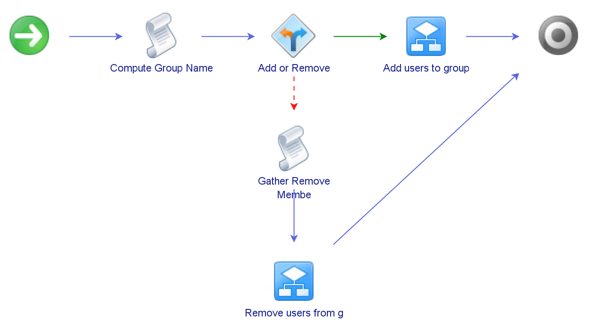

# Manage Local Administrators vRO Workflow

## Overview
This workflow is a proof of concept for allowing the "owner" of a system provisioned in vRealize Automation to manage the local administrators on that system.  It does so on the assumption that the system is joined to an Active Directory domain and there is
a domain group that contains the administrative users.  It relies on the following assumptions and requirements:

* The accounts that will require local admin access will be based in an Active Directory domain
* There is a consistent naming format for the domain group used to control access
* There is a group policy or some other mechanism for adding the domain group to the Local Administrators group on the target system
* A PowerShell host for executing PowerShell commands

## Workflow Schema
The scheme is shown below:

## Workflow Components

### Inputs/Outputs/Attributes
| Name | Type | Value | Description |
|------|------|-------|-------------|
| arrMembersToRemove | Array/AD:User | Not set | |
| groupLocalAdmin | AD:UserGroup | Not set | |
| operationOptions | Array/string | Array [ Add Members, Remove Members] | |
| psHost | PowerShell:PowerShellHost

### Compute Workgroup